# Web Site: Bikecraft

## Sobre Mim
Olá, sou Wesley Moraes, um entusiasta de tecnologia e desenvolvedor de software FullStack. Meu interesse aprimorar interfaces web me levaram a embarcar neste projeto de construção de um site de
venda de bicicletas elétricas, onde serão aplicados todas técnicas e boas práticas.

## Informações Técnicas Do Desenvolvedor:

- **HTML:** Linguagem fundamental para estruturar páginas web.
- **CSS:** Utilizado para estilizar e dar vida às minhas criações.
- **Tailwind:** Utilizado para otimizar meus projetos com react.
- **JavaScript:** Utilizado em projetos pessoais.
- **Typescript:** Utilizado em todos os projetos que eu faço usando react ou next.
- **React:** Utilizado para criar projetos frontend complexos.
- **NextJs-13:** Utilizado para projetos frontEnd robustos.
- **Java:** Utilizado em ambiente de estudos.
- **C#:** Utilizado em projetos pessoais e profissionais .
- **.Net6:** Utilizado em projetos pessoais e profissionais.
- **Springboot:** Utilizado em ambiente de estudos.

## Tecnologias Utilizadas
Este projeto é focado principalmente em HTML e CSS, demonstrando minha habilidade em criar interfaces web atrativas,funcionais e responsivas.

## Progresso do Projeto

### Página Principal
Estou constantemente evoluindo este projeto.

- Header                     (X)
- Header/Responsivo          (X)
- Main                       (X)
- Main/Responsivo            (X)
- Bike                       (X)
- Bike/List                  (X)
- Tecnologia                 (X)
- Tecnologia/Responsivo      (X)
- Seguros                    (X)
- Seguros/Responsivo         (X)
- Footer                     (X)
- Footer/Responsivo          (X)

### Versão Atual: 1.0.0
Nesta versão do projeto, estabeleci apenas o header da página.

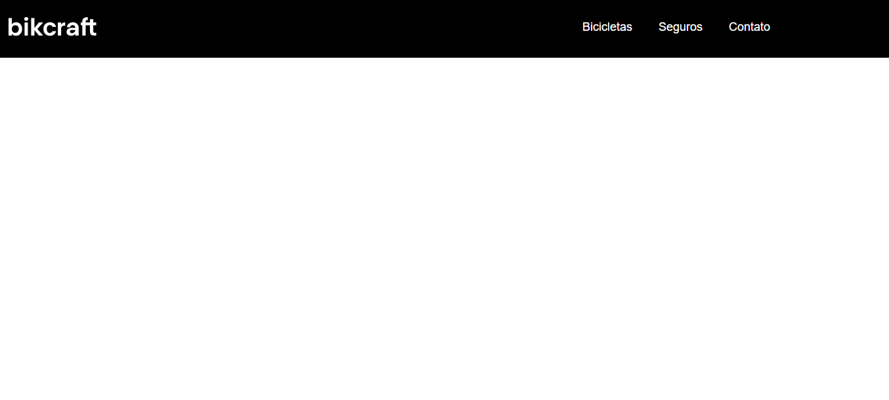

### Versão Atual: 1.0.1
Nesta versão do projeto, header da página vista de um dispositivo mobile.

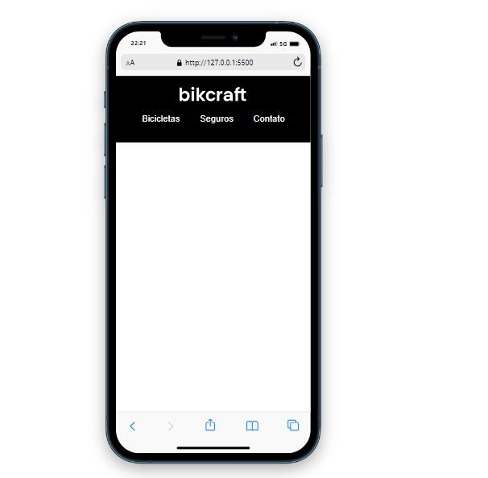

### Versão Atual: 1.0.2
Nesta versão do projeto, estabeleci o conteúdo da página.

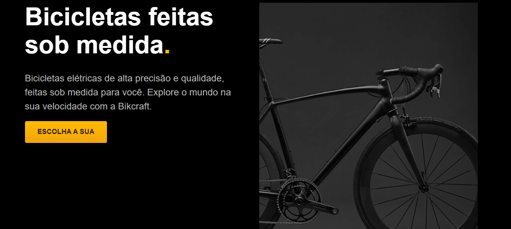

### Versão Atual: 1.0.3
Nesta versão do projeto, estabeleci o conteúdo da página vista de um dispositivo mobile.

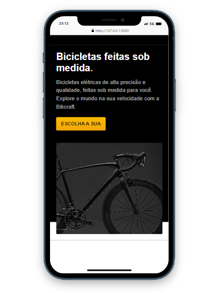

### Versão Atual: 1.0.4
Nesta versão do projeto, foi criado a lista de bicicletas que estão disponível.

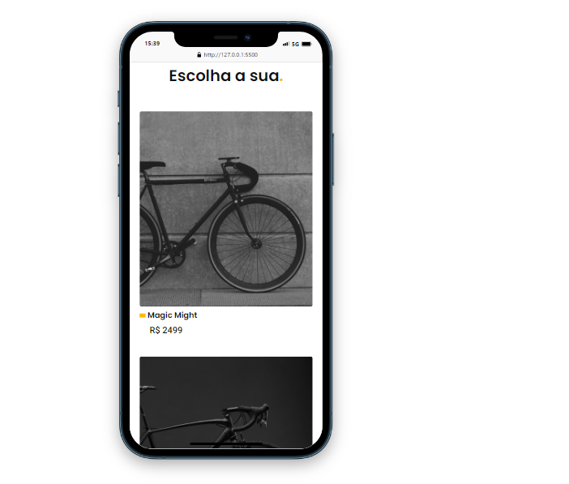
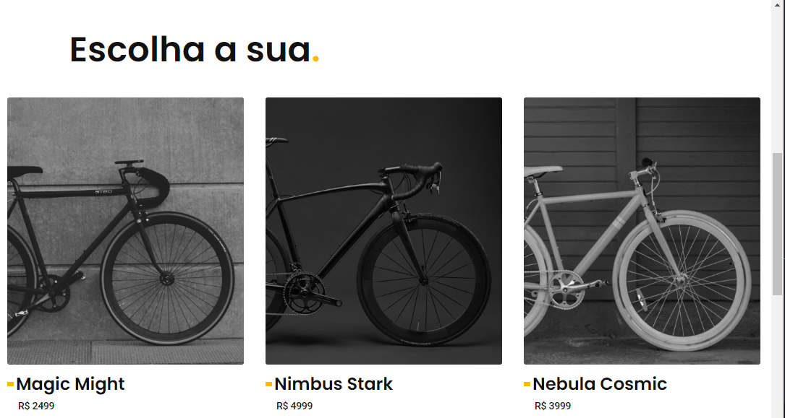

### Versão Atual: 1.0.5
Nesta versão do projeto, foi criado o conteúdo da página referente à tecnologia das bicicletas.

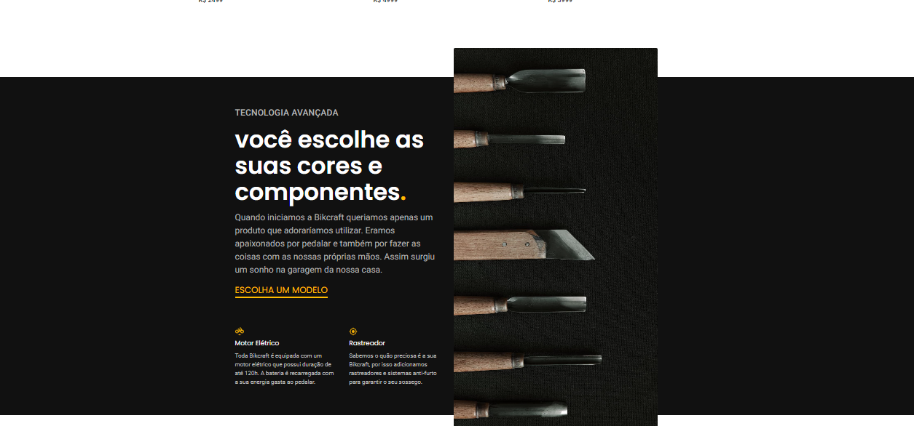
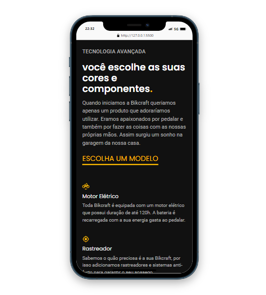

### Versão Atual: 1.0.6
Nesta versão do projeto, é mostrado os parceiros que ajudam a contribuir com a Bycraft.

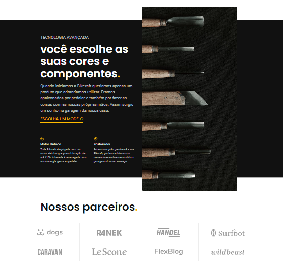
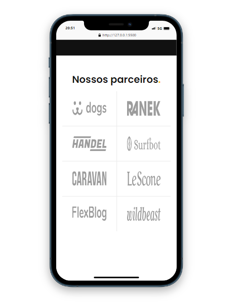

### Versão Atual: 1.0.7
Nesta versão do projeto, é mostrado um depoimento de um cliente satisfeito.

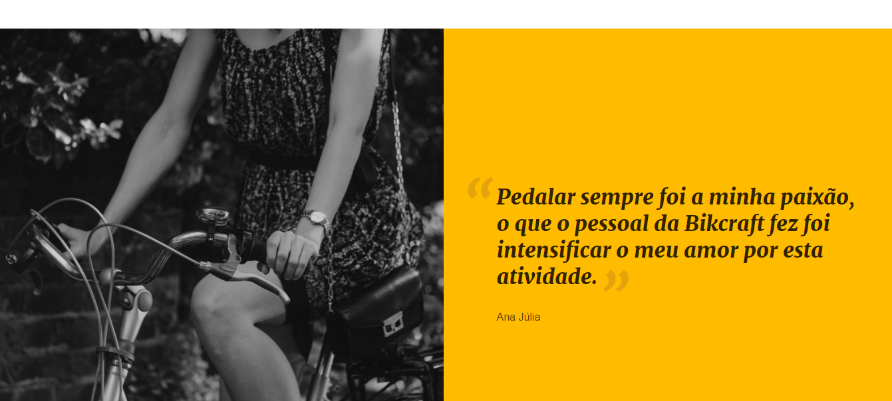

### Versão Atual: 1.0.8
Nesta versão do projeto, é mostrado a parte de seguros de corbetura do serviço do site.

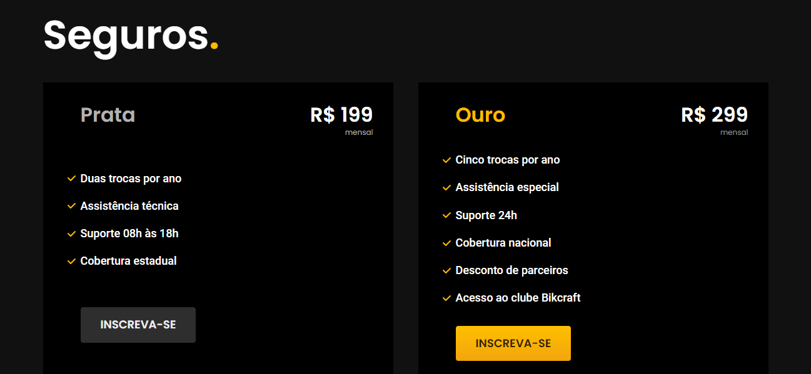
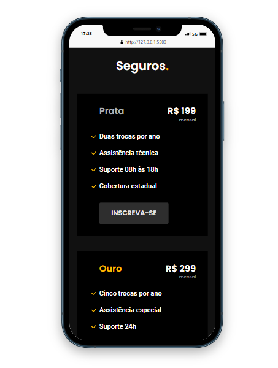

### Versão Atual: 1.0.9
Nesta versão do projeto, é mostrado a finalização da página com o acrescimo do footer da mesma.

[Versão 1.0.9](image_progress/footer.png)
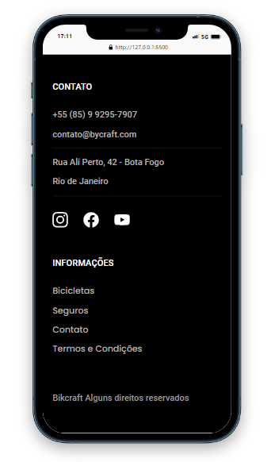

### Página Termos
Estou constantemente evoluindo este projeto.

- Header                     (X)
- Header/Responsivo          (X)
- Main                       (X)
- Main/Responsivo            (X)
- Footer                     (X)
- Footer/Responsivo          (X)

### Versão Atual: 2.0.0
Este é uma página referente termos e condições de uso do produto assim como garantias e assistências.

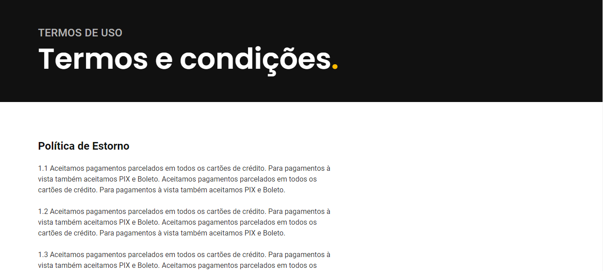
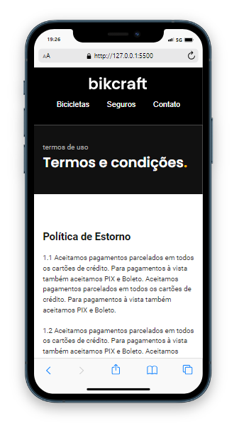

### Página Seguros e Pergutas Frequentes
Estou constantemente evoluindo este projeto.

- Header                     (X)
- Header/Responsivo          (X)
- Main                       (X)
- Main/Responsivo            (X)
- Footer                     (X)
- Footer/Responsivo          (X)

### Versão Atual: 3.0.0
Este é uma página referente seguros ofertados e perguntas frequentes feitas pelo o usuário.

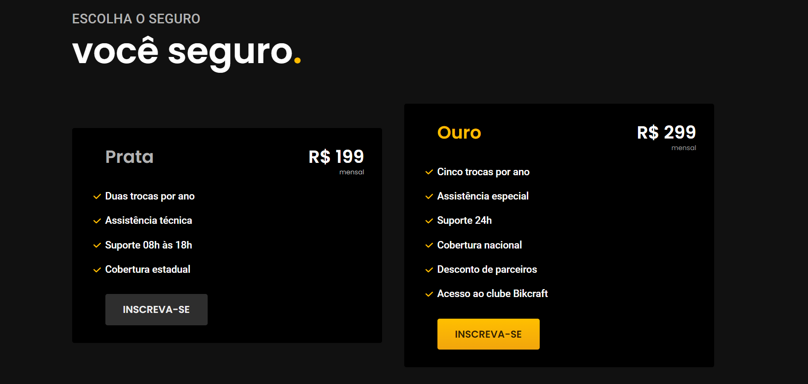
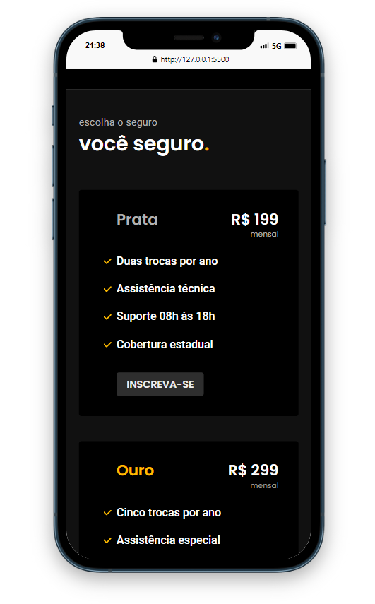
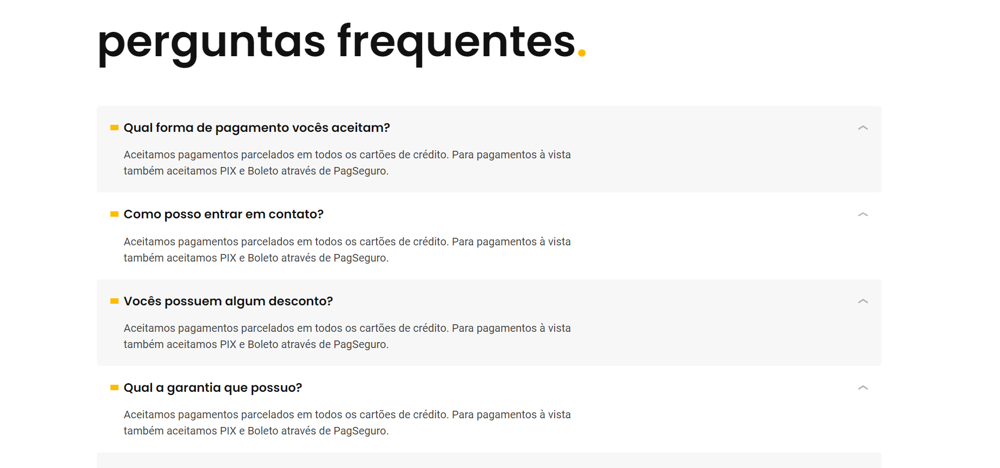
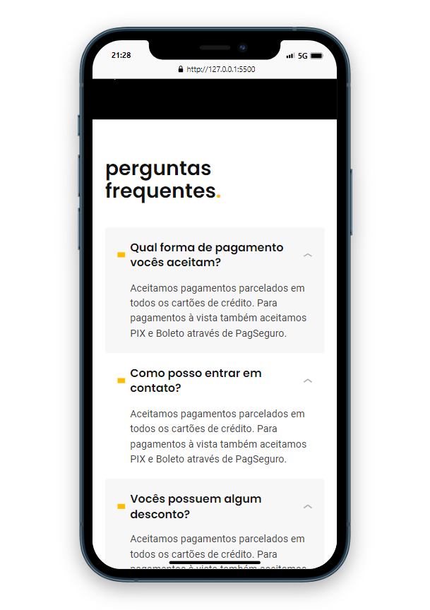

Fique atento para futuras atualizações e melhorias!

## Contato
Se você quiser saber mais sobre este projeto ou trocar ideias sobre desenvolvimento web, entre em contato comigo em [https://www.linkedin.com/in/owesleymoraes/](Linkedin).
